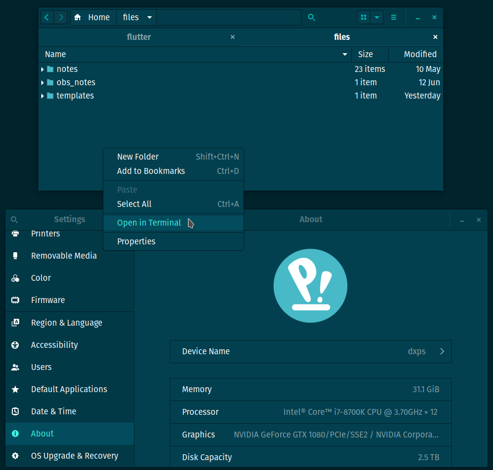

## Marwaita_Pop_os_Dark_Green

This is my Solarized Dark flavor of the wonderful [Marwaita Pop_os](https://www.gnome-look.org/p/1377894/) theme.

Changes to the original work:

- the standard bg, fg, selected and titlebar colors
- the roundness from 5px to 7px

Here is a sample of the result:

However, the screenshot colors are not the same as how they are currently being rendered by my monitor.
